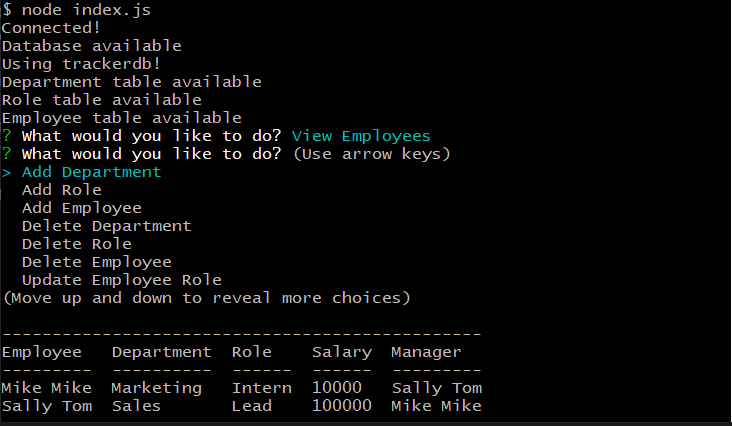

A command line application to track employees, their salaries, the departments and managers they belong to, and their role titles.

# Project Description

This is a simple command line application using Nodejs, MySQL, and Inquirer. It also uses the 'dotenv' node module for keeping your credentials safe.

# Setup/Installation

Once all project files have been downloaded the dependencies will need to be installed via a terminal using your package manager of choice. Next, make sure you have your MySQL service runnning then in your terminal run the command necessary (if using npm, type 'npm start') to run the start script.

# Usage Instructions

Once the app has started spinning up give it a few seconds to: 1) Create the database if necessary, 2) Create the three tables for employees, roles, and departments. When prompted, select an option for what you would like to do. Most likely at first you will want to add either departments, roles, or employees as each one associates data from the former (roles belong to a department and employees have a role).

Now you can choose to update various data like an employee's manager or role, delete a department, role or employee, or simply view the available departments, roles or employees.

